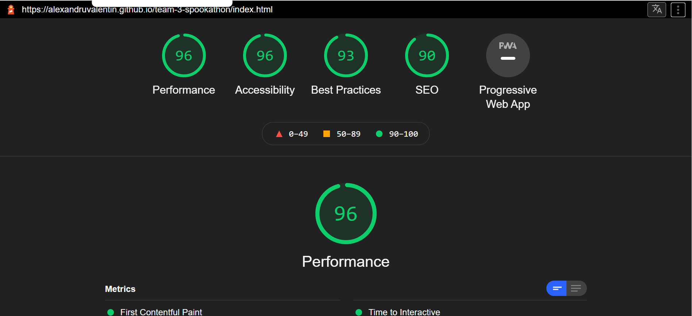

# Creepy House

:jack_o_lantern::ghost::spider::spider_web:

This a Spookathon web app called [*"Creepy House"*](https://alexandruvalentin.github.io/team-3-spookathon/) developed by the **Creeping it real team** .

  Check it out [here](https://alexandruvalentin.github.io/team-3-spookathon/)

## Creeping it real team members

- [Paul Bowden](https://github.com/PaulBowden673)
- [Alexandru Valentin](https://github.com/alexandruvalentin)
- [Tom Dawes](https://github.com/tdawes93)
- [Ken Walsh](https://github.com/kenwals)

---

## Table of contents

- [UX](#ux)
  * [Scope](#scope)
    + [Requirements](#requirements)
  * [User stories](#user-stories)
    + [Visitor goals](#visitor-goals)
      - [Owner goals](#owner-goals)
  * [Structure](#structure)
  * [Skeleton](#skeleton)
    + [Wireframe](#wireframe)
    + [Story Workflow](#story-workflow)
    + [Story Outline](#story-outline)
  * [Surface](#surface)
    + [Colours](#colours)
    + [Icons](#icons)
    + [Images](#images)
    + [Fonts](#fonts)
- [Features](#features)
  * [Existing Features](#existing-features)
  * [Features Left to Implement](#features-left-to-implement)
- [Technologies Used](#technologies-used)
  * [Frontend](#frontend)
    + [Languages](#languages)
    + [Libraries and Frameworks](#libraries-and-frameworks)
    + [Tools](#tools)
- [Testing](#testing)
  * [Performance Testing](#performance-testing)
  * [Functionality Testing](#functionality-testing)
  * [Known issues](#known-issues)
  * [Project barriers and solutions](#project-barriers-and-solutions)
  * [CSS3 validator](#css3-validator)
  * [HTML5 validator](#html5-validator)
  * [JavaScript validator](#javascript-validator)
  * [Testing User Stories](#testing-user-stories)
    + [Visitor Stories](#visitor-stories)
    + [Owner Story](#owner-story)
- [Deployment](#deployment)
  * [GitHub](#github)
  * [Gitpod](#gitpod)
  * [GitHub Pages](#github-pages)
  * [Local Deployment](#local-deployment)
  * [Forking](#forking)
- [Credits](#credits)
  * [Content](#content)
  * [Media](#media)
  * [Acknowledgements](#acknowledgements)

## UX

### Scope

The theme of this project is a Halloween haunted house and Trick or Treat.

#### Requirements

- As Depict a Halloween (or fairy tale) story
- Can be interacted with in some way
- Should have animated elements
- Be creative!

### User stories

#### Visitor goals

1. As a user of this web site, I want to see a Halloween or fairy tale story depicted.

2. As a user of this web site, I want to be able to interact with the site in some way.

3. As a user of this web site, I want to see animated elements.

4. As a user of this web site, I would like to see creativity on the site.

5. As a user of this web site, I want to be scared.

##### Owner goals

1. As the site owner, I want the visitors to be spooked.

### Structure

### Skeleton

#### Wireframe

#### Story Workflow

#### Story Outline

> Page 1.
>
> `You're out trick or treating with your younger sister.
> It's cold, dark and you've strayed away from the streets you know to an unfamiliar part of town.
> You walk up to the next house which is different from the other houses on the road. 
> It has a large wrought iron fence around the perimeter, overgrown trees, bushes hanging over the fence and some broken windows
> on the top floor.
> As you're about to turn around, you notice a light flickering in one of the upstairs rooms. Someone must be home.`
>
> Do you:
> a) walk up to the house and trick or treat
> b) go home, you've got enough sweets for tonight
>
> Answer:
> a) as you approach the door thunder crashes and rain starts pouring down, so you quickly stand under the porch
>
> or
>
> b) you decide to turn around and go home when thunder crashes and rain starts to pour down. You run to the house and stand under the porch
> in order to stay dry.
>
> Page 2. 
>
> The door is open and in the wind, it slowly creeks ajar. You walk in wearily, reassuring your sister it'll be ok.
>
> Inside you are greeted with a large grand staircase with old portraits up the side. All the furniture is covered in sheets, 
> the rugs are old and dusty with cobwebs draped across the banister. There is a chandelier hanging from the ceiling, swaying slowly 
> in the wind. To the left of the room is an open door leading through to a dark room.
>
> Do you:
> a)Call out "hello"
> b)Walk through the open door
>
> Answer:
> a) You shout out"Hello", if someone's home they must have heard you. You hear a creek upstairs, but then silence. 
> Your sister tells you she's scared and doesn't want to go upstairs so you decide to walk through the open door to the left.
>
> or
>
> b) You decide to walk through the door to the left, better to stay downstairs than start sneaking around the whole house.
>
>
> Page 3.
>
> As you enter the room the door suddenly slams behind you, the room is pitch black you can't see you hand in front of your face. Ligthening strikes, the flash lights 
> up the room and you see a shadow in the corner. On the opposite side of the room is another door, this one shut.
>
> Do you:
> a)Open the closed door and see what's inside
> b)Inspect the shadow in the corner
>
> Answer
> a) The shadow in the corner turns out to be a coat hanging from the wall. "See nothing to be scared off" you tell your sister. 
> <!-- go back to the choices -->
>
> or
>
> b) You slowly walk over to the door, "best to keep moving" you tell yourself.
>
> Page 4.
> You walk up to the door and slowly reach for the handle. It's unlocked! As you cautiously open the door a bat frantically
> flies through the doorway at you. <!--Potential jump scare-->
> Taking a moment to compose yourself you walk through into a large dining room.
> The room is dim but you can just make out the table is set for dinner, some candles are lit flickering in the draft, 
> food half eaten and still warm, as if someone left in a rush. One of the windows is left ajar.
>
> Do you:
> a) Walk over to the window to check it out
> b) Use the lit candles on the table to light the rest of the candles in the room
>
> Answer
> a) You walk over to the window and decide to close it to keep the wind and rain out. The window won't move as you try to close it,
> almost like it's painted shut. As you're using all your strength to close the window ou feel a prickly feeling on the back of your neck. 
> You slowly look up and a cobweb full of spiders is directly above you making their way down and starting to crawl all over you.
>
> or
> b)As you walk around the room, lighting the candles, it begins to get clearer and brighter. You notice a large cobweb full of spiders
> over the window. Your sister nervously utters "I don't like spiders, let's not go there". You agree.
>
> Page 5.
>
> You decide it's time to leave, this is getting too creepy. As you're looking for a way out the window slams shut! 
> Frantically searching for a way out you notice a door that wasn't there before.
>
> Do you:
> a) Try this new door
> b) Go back the way you came through the first room
>
> Answer 
> a)You decide to try this new door, again it's unlocked so you slowly push it open and walk through.
>
> or
>
> b)You go back to the first room and over to the door. Someone has locked it! You sprint back to dining room.
>
> < reselect options on page 5>
>
>
> Page 6.
>
> You walk through this new door. Inside it's cold and damp, with stairs heading both up and down infront of you. A draft flows up the
> stairs with a slight howl that sounds like a woman crying out for help. You can't see beyond the 6th step on either set of stairs.
> One way must lead out, but which?
>
> Do you
> a) go up - to page 7.
> b) go down - to page 9.
>
> Page 7.
> a)The door leads out a secret bookcase at the top of the grand staircase. You breathe a sign of releif as you can see the way out.
> You smile at your sister to reassure her. Suddenly footsteps can be heard coming from down the hall.
>
> Do you
> a) run for the front door
> b) go back through the secret bookcase and down the stairs to hide - to page 9
>
> Page 8.
>
> You grab your sister's hand tight and sprint straight down the staircase and for the front door. Bursting through the door you can
> hear the footsteps getting closer and faster. As you're half way down the path you look back to the house, a dark figure is standing in
> the shadows in the doorway, staring at you and your sister. You don't stop running until you're home. 
>
> Congratulations, you made it out of the house safely!
>
> Page 9. 
>
> You head down the stairs, they lead down to the basement. The basement is gloomy with low ceilings, there's a camp bed and wardrobe in
> the corner. It's clear someone is living here. Looking round the room there's a small broken window in the upper corner of the room, a 
> storm door clattering in the wind and creepily behind the stairs there's three cages with beds and chains inside. 
> You hear footsteps coming down the stairs, and the clunk of metal being dragged down each step. Bang. Bang. Bang.
> You have to get out of there fast!
>
> Do you
> a) give you sister a leg up through the broken window, and follow her through - go to page 10.
> b) run to the storm door and try and break out - go to page 11.
>
> Page 10.
>
> a) You manage to help your sister through the window. Yelling at her to run, you pull yourself up to squeeze through the tight gap.
> As you're halfway through someone grabs your legs and pulls you back, into the darkness.
>
> Jump Scare! Unfortunately you have failed to make it out of the house safely
>
> Page 11.
>
> b) The storm door is locked, you barge the door with your shoulder to try and burst it open. It crashes but no movement. You take a step 
> back for another run up and someone grabs you, with their hand over your mouth and pulls you into the shadows.
>
> Jump Scare! Unfortunately you have failed to make it out of the house safely

### Surface

#### Colours

- #2F5363 - **Police Blue**
- #6A994E - **Palm Leaf**
- #fff - **White**
- #00000- **Black**
- #FF934F - **Robin Egg Blue**
- #FFEE88 - **Yellow (Crayola)**
- #BB0A1E - **Blood red**

#### Icons

Font awesome is used for icons.

#### Images

svg images

#### Fonts

- Eater

- Nosifer

- Work sans (google fonts)

back to [contents](#table-of-contents)

---

## Features

### Existing Features

- Interactive scary ghost story
- Creepy animations
- Spooky surprises
- Drop scare

### Features Left to Implement

- Audio

## Technologies Used

### Frontend

#### Languages

- HTML
- CSS
- JavaScript

#### Libraries and Frameworks

- [Bootstrap](https://getbootstrap.com/docs/4.6/getting-started/introduction/)
- [JQuery](https://jquery.com/)
- Fonts : [Google Fonts](https://fonts.google.com/)
- Icons : [Fontawesome](https://fontawesome.com/)

#### Tools

- IDE: Visual Studio Code (VS Code) or Gitpod 
- Version control: Git
- Wireframe: [Balsamiq](https://balsamiq.com/)
- [Responsive mock up display](http://ami.responsivedesign.is/)
- Kanban planner : [Github projects](https://github.com/alexandruvalentin/team-3-spookathon/projects/1).
- [Markdown table of contents creator](https://ecotrust-canada.github.io/markdown-toc/)

back to [contents](#table-of-contents)

---

## Testing

### Performance Testing

Lighthouse test 

### Functionality Testing

### Known issues

### Project barriers and solutions

### CSS3 validator

https://jigsaw.w3.org/css-validator/

### HTML5 validator

https://validator.w3.org/

### JavaScript validator

https://jshint.com/

### Testing User Stories

#### Visitor Stories

#### Owner Story

back to [contents](#table-of-contents)

---

## Deployment

For easy deployment on GitHub pages, you will need a GitHub user account and possibly a Gitpod user account. If you wish to make changes to this repository, please follow the GitHub steps first.

### GitHub

GitHub is a code hosting platform for version control and collaboration. It's free to enrol for a user account and I would recommend you have one if you wish to deploy this repository and make changes.

When you have a GitHub account you can simply click on the Fork button on the top right corner. This will clone the Creep House repository for your GitHub account, then you can make any changes you like.

### Gitpod

The site can be edited easily on a Gitpod online workspace, you first register a free user account on http://gitpod.io/, then download the Gitpod extension on your preferred internet browser. On signing up you will be expected to have a GitHub user account.

Once you have the extension on your browser, a green Gitpod button will appear beside this repository in GitHub. For best results fork the repository in your personal account before you open it in Gitpod.

### GitHub Pages

Once you have the completed site in your own repository, you can deploy it to GitHub pages by the following steps.

1. On GitHub, go to the completed site's repository.
2. Click on settings, on the settings page scroll down the **GitHub Pages** section.
3. Under GitHub pages, Select the appropriate branch or folder the index.html is in.
4. Click on **save.** A message should then appear advising the URL of your deployed site.

### Local Deployment

If you prefer working on the repository locally on your preferred Desktop IDE, you can clone the repository to your desktop by the following steps.

1. Go to (https://github.com/alexandruvalentin/team-3-spookathon/).
2. Above the list of files, click on the **code** button.
3. To clone the repository using **HTTPS,** under "Clone with HTTPS", click the paste icon. To clone the repository using an **SSH key**, click Use SSH, then click the paste icon. To clone a repository using **GitHub CLI,** click Use GitHub CLI, then click the paste icon.
4. Open your preferred Terminal interface.
5. Change the current working directory to the location where you want the cloned directory.
6. Type **git clone**, then paste the URL you copied earlier above.
7. Press Enter to create your local clone.

more detailed instructions available [here](https://docs.github.com/en/free-pro-team@latest/github/creating-cloning-and-archiving-repositories/cloning-a-repository)

### Forking

You may wish to contribute to this website and have your contribution published, if so, you are welcome to follow these steps below.

1. Go to the GitHub website and log in.
2. Open https://github.com/alexandruvalentin/team-3-spookathon/.
3. In the top right-hand corner you will see a fork button, click on this **Fork button**.
4. This will create a copy of the creepy house repository in your Github account.
5. Once you're finished making changes you can locate the **New Pull Request** button just above the file listing in the original repository https://github.com/alexandruvalentin/team-3-spookathon/.
6. If your pull request is approved, it will be merged into the master version of the Creepy House repository at a future date.

more detailed instructions available [here](https://docs.github.com/en/free-pro-team@latest/github/getting-started-with-github/fork-a-repo)

back to [contents](#table-of-contents)

---

## Credits

### Content

- The JS interactive story code is inspired by X
- The animations code is inspired by a linkedin learning course on CSS animation.

### Media

- Creepy house image sourced from unsplash
- svg footer images sourced on google images

### Acknowledgements

- Thanks to [Iryna Sanzhara](https://github.com/irasan) our team faciliator and git lifesaver.
- The Code institute Hackathon team for organising this spooky event.

back to [contents](#table-of-contents)
